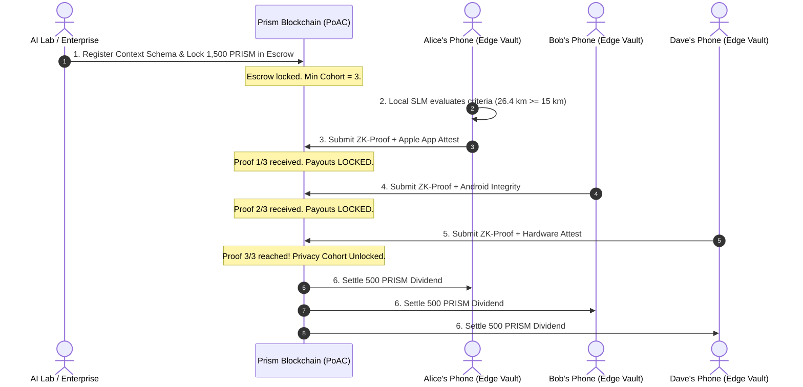

# Prism Network: The Sovereign Context & Edge-AI Ledger

[](https://www.rust-lang.org)
[](LICENSE)
[](crates/prism-consensus)
[](sdk/typescript)

**Prism Network** is a next-generation Layer-1 blockchain engineered specifically for the post-cloud AI era. Unlike legacy blockchains designed purely for financial speculation (Bitcoin, Solana), Prism turns everyday human digital activity into **sovereign, encrypted, income-generating digital assets**.

---

## 🌟 Key Features

1. **Passive "Daily Living Dividend"**: Everyday users earn continuous micro-dividends ($50–$150/mo) by letting their phone answer verified AI research and brand queries.
2. **Zero-Knowledge Context Proofs (zk-CP)**: Raw telemetry (health, fitness, habits, e-commerce) never leaves the user's phone. Only mathematical validity proofs hit the blockchain.
3. **Smart-Contract Enforced $k$-Anonymity**: Anti-de-anonymization protection ($k \ge 3$ on devnet, $k \ge 500$ on mainnet). Escrow payouts are cryptographically locked until at least $k$ unique attested nodes submit valid proofs.
4. **Hardware Anti-Sybil Defense**: Proof-of-Silicon attestation (Apple App Attest / Google Play Integrity) prevents bot farms and cloud emulators from draining enterprise bounties.
5. **P2P Gossip Network**: Peer-to-peer length-delimited wire protocol for distributed block and transaction propagation.
6. **Built-in Web Explorer & Dashboard**: Embedded dashboard running directly out of the node binary.

---

## 🏗️ Repository Architecture

```
Prism/
├── Cargo.toml                  # Cargo Workspace configuration
├── crates/
│   ├── prism-crypto/           # BLAKE3 hashing, Ed25519 keys, ZkProof & HardwareAttestation
│   ├── prism-core/             # Blockchain ledger, Block Merkle trees, State transitions, Escrow
│   ├── prism-consensus/        # Proof-of-Attested-Context (PoAC) consensus engine
│   ├── prism-client/           # On-device Sovereign Context Vault & Edge ZK-Prover
│   ├── prism-p2p/              # Async TCP peer-to-peer gossip networking
│   └── prism-node/             # Full Node binary, Mempool, REST & JSON-RPC API, Web Dashboard
├── apps/
│   └── dashboard/index.html    # Interactive Web Dashboard & Block Explorer
└── sdk/
    └── typescript/             # Official TypeScript SDK (@prism-network/sdk)
```

---

## 🚀 Quickstart Guide

### 1. Run the Workspace Tests
```bash
cargo test
```
All unit and integration tests across crypto, core state transitions, privacy cohorts, and P2P peer networking will execute and pass.

### 2. Run the End-to-End Consumer Economy Simulation
```bash
cargo run --example simulated_economy -p prism-node
```
Simulates an enterprise posting a 1,500 PRISM runner health bounty, edge devices evaluating criteria locally, non-qualifiers leaking 0 data, and qualifying participants receiving their data dividends upon cohort threshold unlock.

### 3. Launch a Live Node & Web Dashboard
```bash
cargo run -p prism-node
```
The node will boot, commit the genesis block, start producing blocks every 3 seconds, and open:
* **Interactive Web Dashboard**: [http://127.0.0.1:8545](http://127.0.0.1:8545)
* **Node Health Endpoint**: [http://127.0.0.1:8545/health](http://127.0.0.1:8545/health)
* **Ledger State Endpoint**: [http://127.0.0.1:8545/api/v1/state](http://127.0.0.1:8545/api/v1/state)

### 4. Build the TypeScript SDK
```bash
cd sdk/typescript
npm install
npm run build
npm test
```

---

## 📜 How the Economy Works



---

## ⚖️ Legal & Privacy Compliance
* **Zero On-Chain Personal Data**: Under GDPR Recital 26, irreversible cryptographic proofs do not constitute personal identifiable data.
* **Exempt from HIPAA**: Self-sovereign edge storage where users hold their own data is legally exempt from covered-entity restrictions.
* **Earned Utility Revenue**: Dividends are compensation for active computational verification and informational work, not passive investment contracts.
