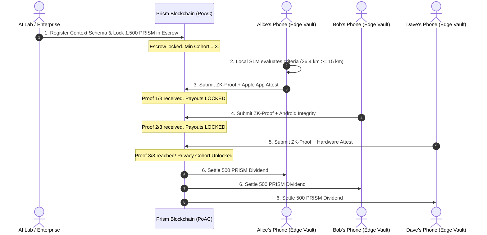

# Prism Network: The Sovereign Context & Edge-AI Ledger

[](https://www.rust-lang.org)
[](LICENSE)
[](crates/prism-consensus)
[](https://jsepkt.github.io/prism/)
[](https://jsepkt.github.io/prism/docs/)
[](sdk/typescript)
[](sdk/python)
[](apps/mobile-native)
[](WHITEPAPER.md)

**Prism Network** is a next-generation Layer-1 blockchain engineered specifically for the post-cloud AI era. Unlike legacy blockchains designed purely for financial speculation, Prism turns everyday human digital activity into **sovereign, encrypted, income-generating digital assets**.

* **Live Web App & Wallet**: [https://jsepkt.github.io/prism/](https://jsepkt.github.io/prism/)
* **Mobile Web View**: [https://jsepkt.github.io/prism/mobile/](https://jsepkt.github.io/prism/mobile/)
* **Interactive Developer Documentation**: [https://jsepkt.github.io/prism/docs/](https://jsepkt.github.io/prism/docs/)

---

## 🌟 Key Features

1. **Passive "Daily Living Dividend"**: Everyday users earn continuous micro-dividends ($50–$150/mo) by letting their phone answer verified AI research and brand queries.
2. **Zero-Knowledge Context Proofs (zk-CP)**: Raw telemetry (health, fitness, habits, e-commerce) never leaves the user's phone. Only mathematical validity proofs hit the blockchain.
3. **Smart-Contract Enforced $k$-Anonymity**: Anti-de-anonymization protection ($k \ge 3$ on devnet, $k \ge 500$ on mainnet). Escrow payouts are cryptographically locked until at least $k$ unique attested nodes submit valid proofs.
4. **Hardware Anti-Sybil Defense**: Proof-of-Silicon attestation (Apple App Attest / Google Play Integrity) prevents bot farms and cloud emulators from draining enterprise bounties.
5. **Autonomous Intent Clearinghouse**: Zero-middleman commerce where AI agents publish consumer purchasing intents and competing solvers bid in real-time (`crates/prism-agent`).
6. **Sustainable Tokenomics & Builder Royalty**:
   - **12,500 per million (1.25% / 125 BPS)** builder protocol royalty on AI query bounties and intent settlements.
   - **2,500 per million (0.25% / 25 BPS)** permanent deflationary burn.
   - Zero tax on everyday consumers—data dividends are delivered 100% net to participating edge users.
7. **P2P Gossip Network**: Peer-to-peer length-delimited wire protocol for distributed block and transaction propagation.
8. **World-Class Web3 Dashboard & Mobile App**: Embedded dark-glassmorphism dashboard with real-time interactive particle physics, Sovereign Web Wallet, 3D icons, Autonomous Intent Clearinghouse, and JSON-RPC terminal.

---

## 🏗️ Repository Architecture

```
Prism/
├── Cargo.toml                  # Cargo Workspace configuration
├── WHITEPAPER.md               # Official Academic Whitepaper v1.0
├── GRANTS.md                   # Grants application guide (Gitcoin, Arbitrum, Solana)
├── Dockerfile                  # Multi-stage container build
├── docker-compose.yml          # 3-Node local P2P cluster
├── crates/
│   ├── prism-crypto/           # BLAKE3 hashing, Ed25519 keys, ZkProof & HardwareAttestation
│   ├── prism-core/             # Blockchain ledger, Block Merkle trees, State transitions, Escrow
│   ├── prism-consensus/        # Proof-of-Attested-Context (PoAC) consensus engine
│   ├── prism-client/           # On-device Sovereign Context Vault & Edge ZK-Prover
│   ├── prism-p2p/              # Async TCP peer-to-peer gossip networking
│   ├── prism-agent/            # Autonomous Intent Solvers & Algorithmic Bidding
│   └── prism-node/             # Full Node binary, Mempool, REST & JSON-RPC API, Web Dashboard
├── apps/
│   ├── dashboard/index.html    # Interactive Web Dashboard, Sovereign Wallet & Block Explorer
│   ├── mobile/index.html       # Responsive Mobile Web App with 3D Icons & Bottom Dock
│   └── mobile-native/          # React Native Expo Starter (HealthKit & Biometrics)
├── docs/
│   └── index.html              # Interactive Developer Documentation Portal
├── sdk/
│   ├── typescript/             # Official TypeScript SDK (@prism-network/sdk)
│   └── python/                 # Official Python SDK & Developer CLI (`prism-sdk`)
└── scripts/
    ├── install.sh              # 1-Line Bash installer for Linux/macOS
    └── install.ps1             # 1-Line PowerShell installer for Windows
```

---

## 🚀 Quickstart Guide

### ⚡ 1-Line Universal Node Installer
Run this in your terminal to instantly download, compile, and install the Prism Node client:

**Linux & macOS:**
```bash
curl -sSL https://raw.githubusercontent.com/jsepkt/prism/main/scripts/install.sh | bash
```

**Windows (PowerShell):**
```powershell
iwr -useb https://raw.githubusercontent.com/jsepkt/prism/main/scripts/install.ps1 | iex
```

---

### 1. Run the Workspace Tests
```bash
cargo test
```
All 10 unit and integration tests across crypto, core state transitions, privacy cohorts, and P2P peer networking will execute and pass.

### 2. Run the End-to-End Consumer Economy Simulation
```bash
cargo run --example simulated_economy -p prism-node
```
Simulates an enterprise posting a 1,500 PRISM runner health bounty, edge devices evaluating criteria locally, non-qualifiers leaking 0 data, and qualifying participants receiving their data dividends upon cohort threshold unlock.

### 3. Launch a Live Node & Web Dashboard
```bash
cargo run -p prism-node
```
The node will boot, commit the genesis block, start producing blocks every 3 seconds, and open:
* **Interactive Web Dashboard**: [http://127.0.0.1:8545](http://127.0.0.1:8545)
* **Node Health Endpoint**: [http://127.0.0.1:8545/health](http://127.0.0.1:8545/health)
* **Ledger State Endpoint**: [http://127.0.0.1:8545/api/v1/state](http://127.0.0.1:8545/api/v1/state)

### 4. Launch Multi-Node Cluster with Docker
```bash
docker-compose up --build
```
Spins up a 3-node P2P cluster interconnected over the gossip network.

### 5. Build the TypeScript SDK
```bash
cd sdk/typescript
npm install
npm run build
npm test
```

### 6. Install & Run the Official Python SDK & CLI (`prism`)
```bash
cd sdk/python
pip install -e .

# Check local validator health
prism status

# Generate autonomous agent Ed25519 keypair
prism keygen

# Run autonomous AI training pipeline
python examples/ai_training_pipeline.py
```

### 7. Run the React Native Mobile Template (iOS / Android)
```bash
cd apps/mobile-native
npm install
npx expo start
```

---

## 📜 How the Economy Works



---

## ⚖️ Legal & Privacy Compliance
* **Zero On-Chain Personal Data**: Under GDPR Recital 26, irreversible cryptographic proofs do not constitute personal identifiable data.
* **Exempt from HIPAA**: Self-sovereign edge storage where users hold their own data is legally exempt from covered-entity restrictions.
* **Earned Utility Revenue**: Dividends are compensation for active computational verification and informational work, not passive investment contracts.
* **Builder Protocol Royalty**: The protocol enshrines a fixed 1.25% (12,500 per million) builder fee on enterprise query escrows and agent intent settlements, funding continuous open-source protocol research and development.
